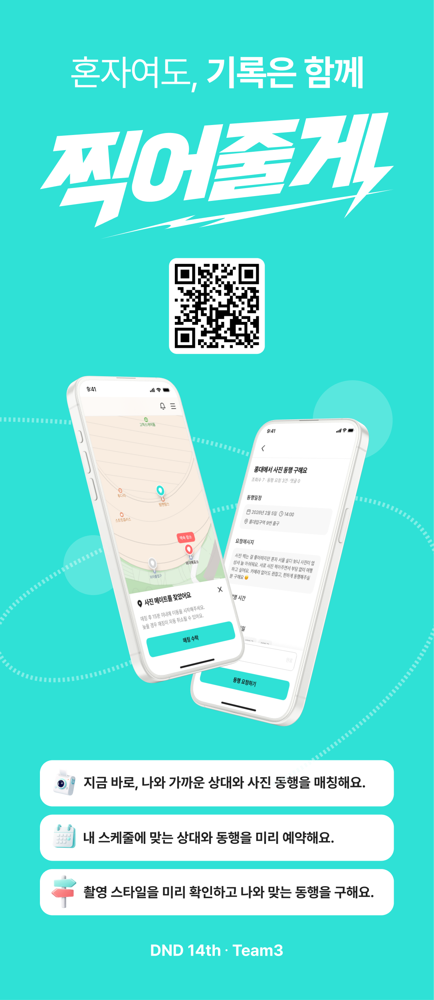

# dnd-14th-3-backend

<!-- PROJECT LOGO -->
 

<h3 align="center">찍어줄게</h3>

  

    혼자여도, 기록은 함께
     
    <a href="https://github.com/dnd-side-project/dnd-14th-3-backend/wiki"><strong>Explore the docs »</strong></a>
     
     
    <a href="https://app.snapforyou.cloud/">View Demo</a>
    &middot;
    <a href="https://github.com/dnd-side-project/dnd-14th-3-backend/issues/new?labels=bug&template=bug_report.md">Report Bug</a>
    &middot;
    <a href="https://github.com/dnd-side-project/dnd-14th-3-backend/issues/new?template=feature_request.md">Request Feature</a>
  

<!-- ABOUT THE PROJECT -->

## About The Project

> 내 사진은 남기고 싶은데.. 혼자 활동하는 편이라 난감한 적 있으시죠?  
> 찍어줄게는 사진을 찍어주는 동행을 연결하는 서비스입니다.  
> 말을 걸지 않아도, 부담을 느끼지 않아도, 같은 장소, 같은 시간에 있는 사람과 자연스럽게 매칭됩니다.

 

<!-- MARKDOWN LINKS & IMAGES -->

[product-screenshot]: images/screenshot.png
